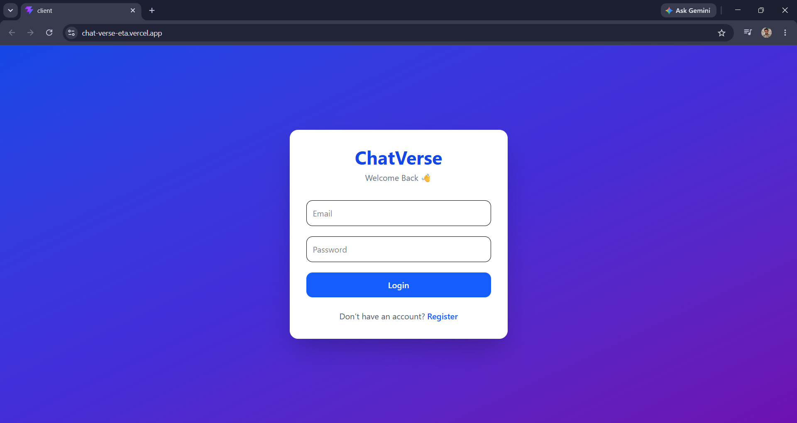
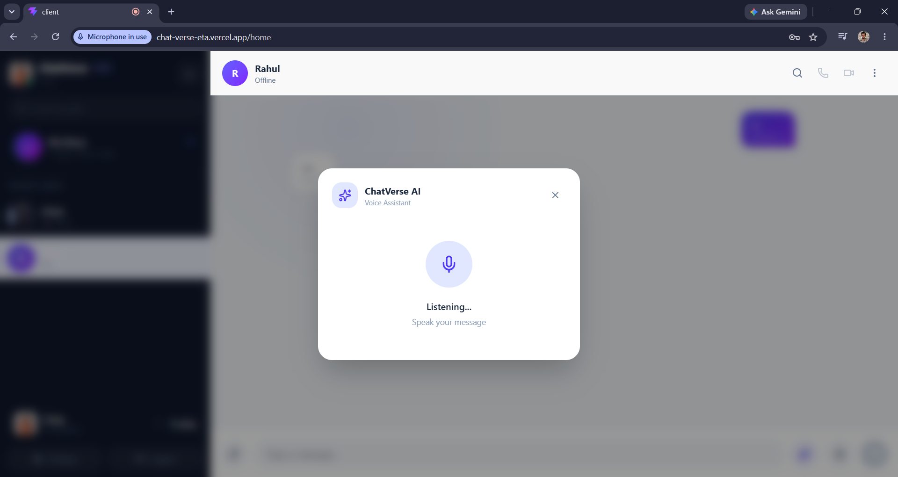

# 💬 ChatVerse

> A full-stack real-time communication platform with AI assistance, instant messaging, media sharing, and voice/video calling.

## 🚀 Live Demo

**[ChatVerse – Live Application](https://chat-verse-eta.vercel.app/)**

## 📌 About

ChatVerse is a full-stack real-time chat application designed to provide a modern communication experience with real-time messaging, AI-powered assistance, media sharing, and voice/video communication.

The application uses a React frontend and Node.js/Express backend, with MongoDB for persistent data storage and Socket.IO for real-time communication.

## ✨ Features

* 🔐 User registration and secure authentication
* 💬 Real-time one-to-one/group messaging
* ⚡ Real-time message delivery using Socket.IO
* ✏️ Edit messages
* 🗑️ Delete messages
* 📋 Copy messages
* 🟢 Online/offline user status
* ⌨️ Typing indicators
* 🤖 AI-powered chat assistance
* 🖼️ Image/media upload with Cloudinary
* 📞 Voice calling
* 🎥 Video calling
* 🔔 Real-time call signaling
* 📊 Poll functionality
* 👤 User profiles
* 🔒 JWT-based authentication
* 📱 Responsive chat interface

## 📸 Screenshots

### 🔐 Authentication



### 💬 Real-Time Chat


### 🤖 AI Assistant



## 🛠️ Tech Stack

### Frontend

* React.js
* JavaScript
* Vite
* Axios
* Socket.IO Client
* CSS

### Backend

* Node.js
* Express.js
* Socket.IO
* JWT
* REST APIs

### Database & Services

* MongoDB Atlas
* Cloudinary
* Google Gemini API

### Deployment

* Vercel — Frontend
* Render — Backend
* MongoDB Atlas — Database

## 🏗️ Project Structure

```text
ChatVerse/
│
├── client/
│   ├── src/
│   ├── public/
│   ├── package.json
│   └── ...
│
├── server/
│   ├── config/
│   ├── controllers/
│   ├── models/
│   ├── routes/
│   ├── middleware/
│   ├── server.js
│   ├── package.json
│   └── .env
│
├── .gitignore
├── LICENSE
└── README.md
```

## ⚙️ Getting Started

### Prerequisites

Make sure you have installed:

* Node.js
* npm
* MongoDB Atlas account
* Cloudinary account
* Google Gemini API key

### 1. Clone the repository

```bash
git clone https://github.com/Ankit7486/ChatVerse.git
cd ChatVerse
```

### 2. Install frontend dependencies

```bash
cd client
npm install
```

### 3. Install backend dependencies

Open another terminal:

```bash
cd server
npm install
```

### 4. Configure environment variables

Create a `.env` file inside the `server` directory.

Example:

```env
MONGO_URI=
JWT_SECRET=
GEMINI_API_KEY=
CLOUDINARY_CLOUD_NAME=
CLOUDINARY_API_KEY=
CLOUDINARY_API_SECRET=
```

Never commit your actual `.env` file or API keys.

### 5. Start the backend

```bash
cd server
npm run dev
```

### 6. Start the frontend

In another terminal:

```bash
cd client
npm run dev
```

The application will then be available through the Vite development server.

## 🔄 Application Architecture

```text
                 ┌──────────────────┐
                 │   React Client   │
                 │     Vite         │
                 └────────┬─────────┘
                          │
                 REST API │ Socket.IO
                          │
                          ▼
                 ┌──────────────────┐
                 │ Node.js +        │
                 │ Express Server   │
                 └───────┬──────────┘
                         │
              ┌──────────┼───────────┐
              │          │           │
              ▼          ▼           ▼
         MongoDB     Cloudinary   Gemini API
         Atlas        Media       AI Services
```

## 🔐 Security

* JWT authentication is used for protected requests.
* Sensitive credentials are stored in environment variables.
* `.env` files are excluded from Git using `.gitignore`.
* API keys and database credentials should never be committed to the repository.

## 🚀 Deployment

The application is deployed using:

* Frontend → Vercel
* Backend → Render
* Database → MongoDB Atlas

Push changes to the `main` branch to trigger a new deployment through the connected deployment platforms.

## 🔮 Future Improvements

* End-to-end message encryption
* Push notifications
* Message reactions
* File/document sharing
* Advanced group administration
* Message search
* Read receipts
* Improved AI conversation memory
* Mobile application
* Enhanced call quality and WebRTC infrastructure

## 👨‍💻 Author

**Ankit Raj**

Built as a full-stack web development project to explore real-time communication, AI integration, backend development, and modern deployment workflows.

## 📄 License

This project is licensed under the MIT License.
